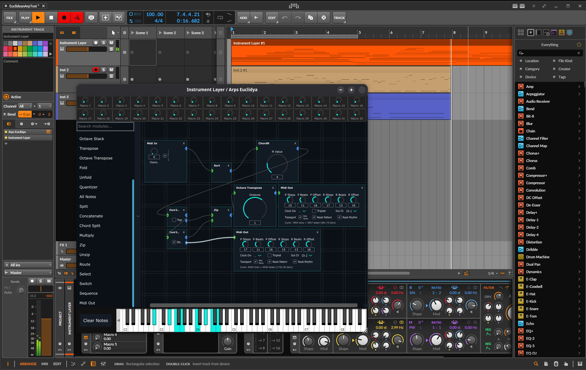

# Arps Euclidya

**Arps Euclidya** is a modular, node-based MIDI environment designed for complex rhythmic and melodic orchestration. Built with a di-graph architecture, it allows for non-linear MIDI routing, advanced chord transformations, and a unique decoupled Euclidean engine.

> [!WARNING]
> **Beta Software**: Arps Euclidya is currently in active development. Features may change, and you may encounter bugs. Please report issues and backup your projects!

[](https://youtu.be/zL0USwwGseI)

## Why Arps Euclidya?

Traditional arpeggiators are often limited to linear patterns and fixed rhythmic scales. Arps Euclidya offers a different approach by decoupling the "what" from the "when":

* **Decoupled Complexity**: A dual-layer Euclidean engine separates melodic step progression from rhythmic triggering, enabling high-order syncopation that remains musically grounded.
* **Modular Freedom**: No fixed signal path. Route any node to any other (acyclically) to create custom generative systems, logic-based switches, or parallel processing chains.
* **Chord-First Workflow**: Specialized logic for polyphonic performance. Extract top/bottom notes, stack octaves, or unzip chords into separate monophonic sequences.
* **Limitless Routing**: Support for multiple Input and Output nodes per patch. Control multiple software instruments or hardware synths from a single performance, or merge inputs from multiple controllers.

## Key Features

* **Dual-Layer Euclidean Engine**: Independently control pattern (note skip/play) and rhythm (trigger/rest) layers for evolving polyrhythms.
* **25+ Specialized Nodes**: Includes Brownian Walk, Converge/Diverge, Quantizers, Octave Stacks, Chord Combinations, and much more.
* **Interactive Node Graph**: A high-performance interactive graph-based workspace with smooth pan/zoom, snap-to-grid, and intuitive drag-and-drop patching.
* **Instant Recalculation**: A topological execution engine ensures zero-latency response to parameter changes and MIDI input.
* **32 Global Macros**: A fully visual macro system with color-coded knobs, shift+drag binding, intensity arcs, dual-value display, and bipolar/unipolar toggling — exposing your internal patch parameters to DAW automation and MIDI controllers.
* **Native MPE Support**: Comprehensive support for per-note expression (Pitch, Pressure, Timbre) across the modular chain. See the [MPE Setup Guide](https://github.com/chalkwalk/arps-euclidya/wiki/8_MPE_Setup) for DAW configuration.

## Build Instructions

Arps Euclidya is built using **CMake** (3.22+) and requires a C++17 compliant compiler.

### Standard Build Workflow

```bash
# 1. Clone the repository
git clone https://github.com/chalkwalk/arps-euclidya.git

cd arps-euclidya

# 2. Initialize submodules (JUCE and extensions)
git submodule update --init --recursive

# 3. Create and enter build directory
mkdir build && cd build

# 4. Configure and build
# On Linux/macOS, we highly recommend using Clang to match the CI environment.
# Note: On Linux, include llvm-ar/ranlib to avoid LTO plugin mismatches.
cmake -DCMAKE_C_COMPILER=clang -DCMAKE_CXX_COMPILER=clang++ -DCMAKE_AR=llvm-ar -DCMAKE_RANLIB=llvm-ranlib ..

# For Windows or default compiler:
# cmake ..

cmake --build . -j $(nproc)
```

The build process will generate:

* **Standalone Application**
* **VST3 Plugin**
* **CLAP Plugin** (using the juce-clap-extensions) — *Recommended for Bitwig, Reaper, Studio One, FL Studio, and other CLAP-supporting DAWs.*

## Installation (Linux)

To install the plugins, you can copy or symlink the build artifacts into your system's standard folders.

### VST3

Copy or link the `.vst3` bundle to `~/.vst3/`:

```bash
ln -s $(pwd)/src/ArpsEuclidya_artefacts/VST3/"Arps Euclidya.vst3" ~/.vst3/
```

### CLAP

Copy or link the `.clap` file to `~/.clap/`:

```bash
ln -s $(pwd)/src/ArpsEuclidya_artefacts/CLAP/"Arps Euclidya.clap" ~/.clap/
```

## Credits & License

Developed by ChalkWalk. Special thanks to the JUCE framework and the CLAP development community.

This project is licensed under the GPL-3.0 License - see the [LICENSE](LICENSE) file for details.
